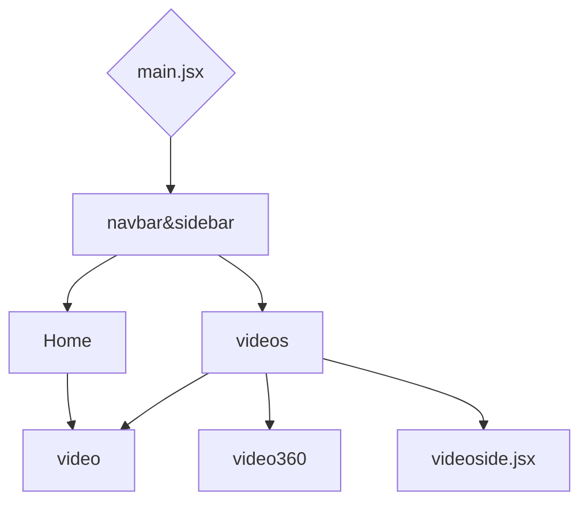

### Overview:

The **360° Video Streaming Platform** is an innovative web-based service that enables users to stream immersive 360-degree videos. This platform is designed to deliver high-quality, interactive video experiences where users can control the viewing angle, exploring the content from any direction in real-time. The application is built using modern web technologies to ensure seamless performance and a rich user experience across various devices.

&nbsp;

### Installation:

Prerequisites

- &nbsp;&nbsp;&nbsp;&nbsp;Node.js (version 16.0.0 or higher)
- &nbsp;&nbsp;&nbsp;&nbsp;npm (version 7.0.0 or higher)
- &nbsp;&nbsp;&nbsp;&nbsp;vite

### Setup:

1. Clone the repository:

- [ ] git clone <https://github.com/hari03032004/Deovr.git>
- [ ] cd Deovr

2. Install dependencies:

- [ ] &nbsp;&nbsp;npm install
- [ ] &nbsp;npm install vite @vitejs/plugin-react

3. Start the development server:

- npm start

4. Deployment:

- npm run dev
- ctrl+click&nbsp;

5. File Structure:

- Public:
  - Output.mp4
  - vite.svg
- src:
  - assets
    - react.svg
  - components
    - <SwmPath>[src/components/Button.jsx](/src/components/Button.jsx)</SwmPath>
    - <SwmPath>[src/components/Navbar.jsx](/src/components/Navbar.jsx)</SwmPath>
    - <SwmPath>[src/components/Searchbar.jsx](/src/components/Searchbar.jsx)</SwmPath>
    - <SwmPath>[src/components/Sidebar.css](/src/components/Sidebar.css)</SwmPath>
    - <SwmPath>[src/components/SidebarData.jsx](/src/components/SidebarData.jsx)</SwmPath>
    - <SwmPath>[src/components/ToggleButton.jsx](/src/components/ToggleButton.jsx)</SwmPath>
    - <SwmPath>[src/components/TopNavbar.css](/src/components/TopNavbar.css)</SwmPath>
    - <SwmPath>[src/components/TopNavbar.jsx](/src/components/TopNavbar.jsx)</SwmPath>
    - <SwmPath>[src/components/TopNavbarData.jsx](/src/components/TopNavbarData.jsx)</SwmPath>
    - <SwmPath>[src/components/Video.jsx](/src/components/Video.jsx)</SwmPath>
  - <SwmPath>[src/App.css](/src/App.css)</SwmPath>
  - <SwmPath>[src/App.jsx](/src/App.jsx)</SwmPath>
  - <SwmPath>[src/index.css](/src/index.css)</SwmPath>
  - <SwmPath>[src/main.jsx](/src/main.jsx)</SwmPath>
- <SwmPath>[.eslintrc.cjs](/.eslintrc.cjs)</SwmPath>
- <SwmPath>[.gitignore](/.gitignore)</SwmPath>
- <SwmPath>[README.md](/README.md)</SwmPath>
- <SwmPath>[df'dksfpds](/df'dksfpds)</SwmPath>
- <SwmPath>[index.html](/index.html)</SwmPath>
- <SwmPath>[package.json](/package.json)</SwmPath>

- <SwmPath>[vite.config.js](/vite.config.js)</SwmPath>

### Work Flow:(Video-player)

&nbsp;

<SwmMeta version="3.0.0" repo-id="Z2l0aHViJTNBJTNBRGVvdnIlM0ElM0FWYXNhbnRoYW4xMTExMDI=" repo-name="Deovr">Powered by [Swimm](https://app.swimm.io/)</SwmMeta>
